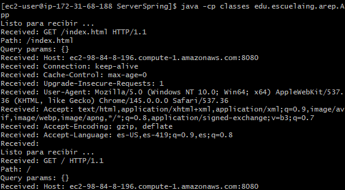
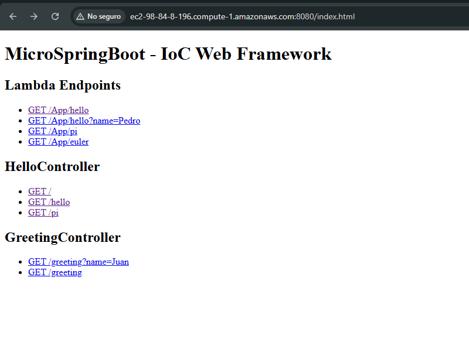
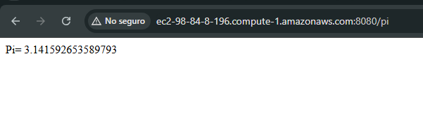
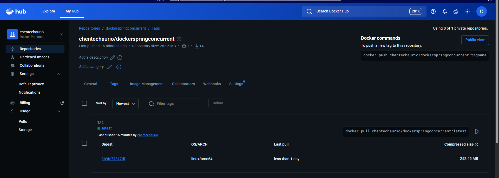
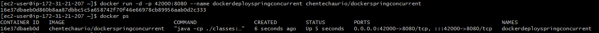
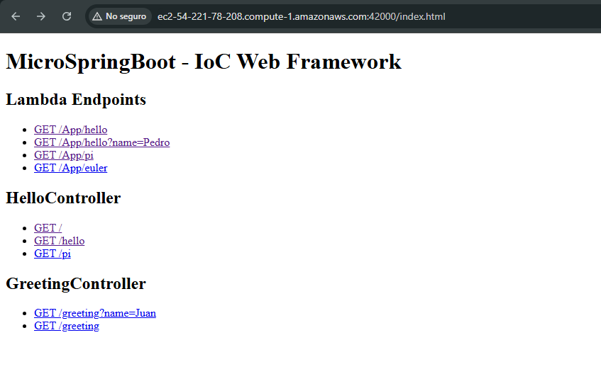

# MicroSpringBoot - IoC Web Framework in Java

A lightweight IoC (Inversion of Control) web framework built from scratch in Java, inspired by Spring Boot. It serves static files (HTML, CSS, JS, PNG, JPG) and supports POJO-based REST controllers through Java Reflection.

## Update for Current Delivery (Concurrency + Graceful Shutdown)

The framework was improved to support concurrent requests and graceful shutdown without using Spring.

- Concurrency is handled with a fixed worker pool (`ExecutorService`) that processes clients in parallel.
- Shared server state uses thread-safe structures (`ConcurrentHashMap`, `AtomicBoolean`) to avoid race conditions.
- Graceful shutdown is implemented with a JVM shutdown hook (`Runtime.getRuntime().addShutdownHook(...)`) that invokes `HttpServer.stop()`.
- On shutdown, the server stops accepting new connections, closes `ServerSocket`, and waits for in-flight tasks to finish before forcing termination.

## Architecture

The framework has two usage modes:

### 1. Lambda-style API (`App.java`)

Register endpoints directly using lambdas, similar to Express.js:

```java
staticfiles("/webroot");
get("/App/hello", (req, resp) -> "Hello " + req.getValues("name"));
get("/App/pi",    (req, resp) -> String.valueOf(Math.PI));
start();
```

### 2. Annotation-based IoC (`MicroSpringBoot2.java`)

Load any POJO annotated with `@RestController` via command line using Java Reflection:

```java
@RestController
public class GreetingController {
    @GetMapping("/greeting")
    public String greeting(@RequestParam(value = "name", defaultValue = "World") String name) {
        return "Hola " + name;
    }
}
```

### Class Diagram

```
HttpServer          ← Core HTTP server (ServerSocket on port 8080)
├── WebMethod       ← Functional interface: (HttpRequest, HttpResponse) → String
├── HttpRequest     ← Encapsulates request path and query params
└── HttpResponse    ← Response object

MicroSpringBoot2    ← Reflection-based IoC loader
├── @RestController ← Marks a class as a REST controller
├── @GetMapping     ← Maps a method to a URL path
└── @RequestParam   ← Binds a query parameter to a method argument

Controllers
├── HelloController     ← Static methods, multiple @GetMapping routes
└── GreetingController  ← Instance method with @RequestParam
```

### Key Components

| Class              | Description                                                                            |
| ------------------ | -------------------------------------------------------------------------------------- |
| `HttpServer`       | Accepts TCP connections, parses HTTP requests, dispatches to endpoints or static files |
| `MicroSpringBoot2` | Uses `Class.forName()` + reflection to load controllers at runtime                     |
| `WebMethod`        | Functional interface enabling lambda endpoints                                         |
| `HttpRequest`      | Holds path and parsed query parameters                                                 |
| `@RestController`  | Annotation to mark a class as a web component                                          |
| `@GetMapping`      | Annotation to map a URL path to a method                                               |
| `@RequestParam`    | Annotation to extract and default query parameters                                     |

### Concurrency Design

- **Connection acceptance:** main server loop accepts sockets while server state is `running`.
- **Task dispatch:** each accepted socket is delegated to the worker pool (`workerPool.execute(...)`).
- **Endpoint registry:** routes are stored in a concurrent map so reads/writes are safe under load.

### Graceful Shutdown Design

- **Trigger:** JVM shutdown signal (e.g., `Ctrl + C`, container stop) activates the shutdown hook.
- **Sequence:** set `running=false` → close `ServerSocket` → `shutdown()` worker pool → wait with timeout → `shutdownNow()` only if needed.
- **Result:** active requests can complete within the timeout, reducing abrupt termination.

## Prerequisites

- Java JDK 17+
- Maven 3.x
- Docker Desktop or Docker Engine
- `JAVA_HOME` must point to a JDK (not a JRE)

To set `JAVA_HOME` temporarily in PowerShell:

```powershell
$env:JAVA_HOME = "C:\Program Files\Java\jdk-17"
```

## Build and Run

### Build

```bash
cd SpringBoot
mvn clean compile
```

The project is configured with the Maven Dependency Plugin so that `mvn compile` also copies runtime dependencies into `target/dependency/`. This is required to run the app with external dependencies and to build the Docker image from the compiled artifacts.

### Run the lambda-style server

```bash
java -cp "target/classes;target/dependency/*" edu.escuelaing.arep.App
```

Then open: [http://localhost:8080/index.html](http://localhost:8080/index.html)

### Run the reflection-based IoC server

```bash
java -cp "target/classes;target/dependency/*" edu.escuelaing.arep.MicroSpringBoot2 \
  edu.escuelaing.arep.GreetingController \
  /greeting?name=Juan
```

## Available Endpoints (App.java)

| Method | URL                 | Response               |
| ------ | ------------------- | ---------------------- |
| GET    | `/App/hello?name=X` | `Hello X`              |
| GET    | `/App/pi`           | `3.141592653589793`    |
| GET    | `/App/euler`        | `e= 2.718281828459045` |
| GET    | `/index.html`       | Static HTML page       |

## Available Endpoints (MicroSpringBoot2 + HelloController)

```bash
java -cp "target/classes;target/dependency/*" edu.escuelaing.arep.MicroSpringBoot2 \
  edu.escuelaing.arep.HelloController /
# → Greetings from Spring Boot!

java -cp "target/classes;target/dependency/*" edu.escuelaing.arep.MicroSpringBoot2 \
  edu.escuelaing.arep.HelloController /hello
# → Hello World

java -cp "target/classes;target/dependency/*" edu.escuelaing.arep.MicroSpringBoot2 \
  edu.escuelaing.arep.GreetingController /greeting?name=Juan
# → Hola Juan

java -cp "target/classes;target/dependency/*" edu.escuelaing.arep.MicroSpringBoot2 \
  edu.escuelaing.arep.GreetingController /greeting
# → Hola World  (uses defaultValue)
```

## Tests

```bash
mvn test
```

Tests cover:

- `HelloController` return values for all routes
- `GreetingController.greeting()` with and without a name
- `@RestController` annotation presence on both controllers
- `@GetMapping` annotation value on `HelloController.index()` and `GreetingController.greeting()`
- `@RequestParam` annotation value and `defaultValue` on `GreetingController.greeting()`
- `HttpRequest.getValues()` returns correct value and empty string for missing keys

### Test evidence

```
[INFO] Tests run: 12, Failures: 0, Errors: 0, Skipped: 0
```

Additionally, framework-level behavior to validate for this delivery:

- concurrent request handling with multiple simultaneous clients
- graceful shutdown behavior when stopping the JVM/container

## AWS Deployment

Two deployment approaches were validated during the delivery: direct execution on the EC2 instance and containerized deployment with Docker.

### Direct execution on EC2

Steps followed:

1. Compile the project in `SpringBoot/`: `mvn clean compile`
2. Open the EC2 security group inbound rule for port `8080`
3. Connect to the instance through SSH
4. Run the application with compiled classes and copied dependencies:

```bash
java -cp "SpringBoot/target/classes:SpringBoot/target/dependency/*" edu.escuelaing.arep.App
```

### EC2 Instance (AWS Console)


### SSH Connection to the server



### Application running in browser



### Endpoints working on the deployed instance



## Docker Deployment

After compiling the project, the container image was built from the repository root using the compiled artifacts in `SpringBoot/target/`.

### Build and publish the image

```bash
docker build --tag chentechaurio/dockerspringconcurrent:latest .
docker push chentechaurio/dockerspringconcurrent:latest
```

### Run the container on the EC2 instance

```bash
docker run -d -p 8080:8080 --name dockerspringconcurrent chentechaurio/dockerspringconcurrent:latest
```

### Docker repository published in Docker Hub



### Container running on the EC2 instance



### Application running from the deployed container



## Project Structure

```
src/
├── main/java/edu/escuelaing/arep/
│   ├── App.java                  ← Entry point (lambda API)
│   ├── HttpServer.java           ← Core HTTP server
│   ├── HttpRequest.java          ← Request model
│   ├── HttpResponse.java         ← Response model
│   ├── WebMethod.java            ← Functional interface
│   ├── MicroSpringBoot2.java     ← IoC loader via reflection
│   ├── HelloController.java      ← Example controller
│   ├── GreetingController.java   ← Example controller with @RequestParam
│   ├── GetMapping.java           ← @GetMapping annotation
│   ├── RestController.java       ← @RestController annotation
│   └── RequestParam.java         ← @RequestParam annotation
├── main/resources/webroot/
│   └── index.html                ← Static HTML page
└── test/java/edu/escuelaing/arep/
    └── AppTest.java              ← Unit tests
```
